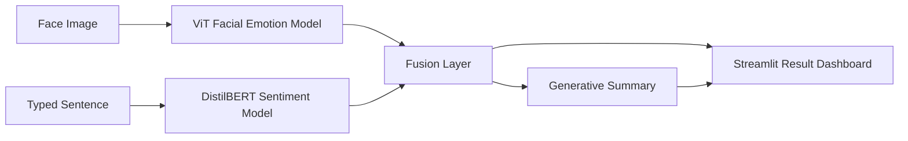

# MoodSyncAI

MoodSyncAI is a DA3 final project prototype for multi-modal sentiment and emotion analysis. It compares what a person says with what their face appears to express, then reports whether the signals are aligned, mismatched, or uncertain.

## Assignment Fit

The project matches the core requirements from the DA3 final assignment:

- Image modality: facial emotion recognition from an uploaded face image using a Vision Transformer image-classification model.
- Text modality: sentiment analysis from typed speech/transcript input using a transformer model.
- Multimodal fusion: combines text sentiment and visual emotion into `ALIGNED`, `MISMATCH`, or `UNCERTAIN`.
- Generative summary: produces a plain-language explanation of the combined emotional state, with a safe fallback if the generative model is unavailable.
- Functional UI: Streamlit application with upload, text input, confidence metrics, emotion distribution chart, fusion result, and explanation.
- Optional extended feature: webcam face capture.

## How To Run

Create and activate a Python environment, install dependencies, then start Streamlit:

```bash
pip install -r requirements.txt
streamlit run app/main.py
```

In this workspace, the virtual environment already exists, so you can run:

```bash
venv/bin/streamlit run app/main.py
```

## Demo Flow

1. Open the Streamlit app.
2. Upload a clear image of a person's face or capture one with the webcam.
3. Type the sentence the person said.
4. Example typed sentence:

```text
No, I think the project is going really well.
```

5. Review the outputs:

- Textual sentiment and confidence
- Visual emotion and confidence
- Emotion distribution chart
- Fusion result
- Plain-language explanation

## Optional Feature Implemented

- Webcam capture: use the `Use webcam` option to capture a live face image directly in the app.

## Architecture



## Main Files

- `app/main.py`: Streamlit UI and inference flow
- `models/image_model.py`: visual emotion classifier wrapper
- `models/text_model.py`: text sentiment classifier wrapper
- `models/fusion.py`: multimodal alignment and mismatch logic
- `models/generator.py`: explanation generator
- `utils/config.py`: model names and emotion groups
- `data/sample_images/`: sample images for quick testing

## Current Limitations

- The fusion layer is rule-based rather than trained.
- The text model predicts positive/negative sentiment only, so neutral language is handled indirectly.
- The image model expects a clear face image; blurry, cropped, or multi-person images may reduce accuracy.
- The generative model is loaded locally when available. If unavailable, the app still returns a deterministic summary so the demo does not fail without internet.

## Possible Extensions

- Short-video input with a timeline of emotion changes.
- Audio input with Whisper transcription as a third modality.
- Grad-CAM or attention visualisation for explainability.
- Learned fusion model trained on paired text-image examples.
- Deployment to Streamlit Cloud or Hugging Face Spaces.
